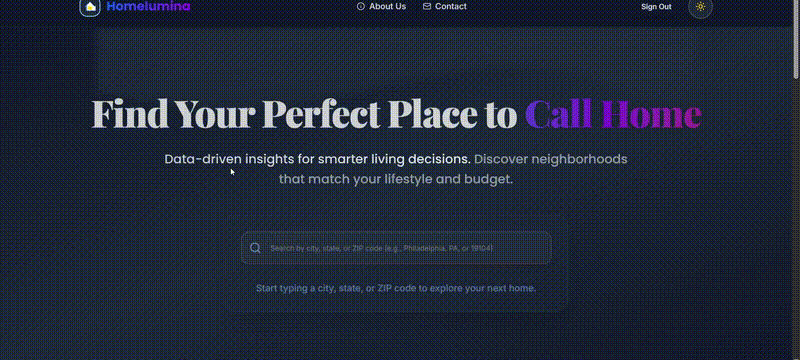
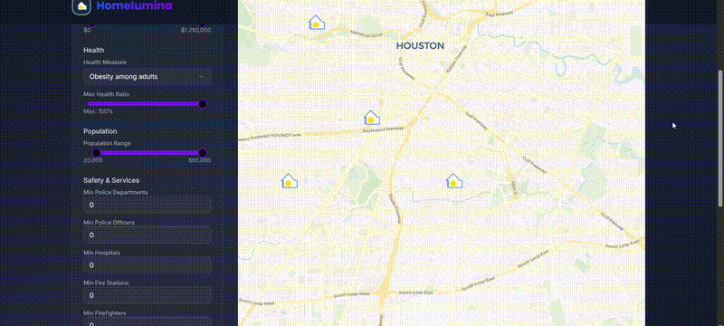
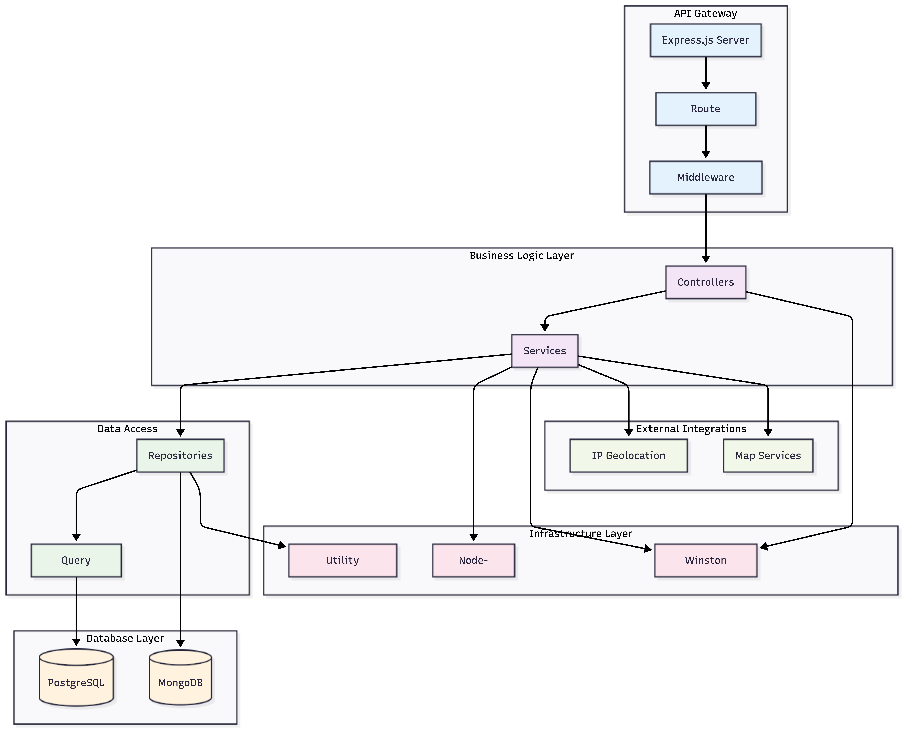
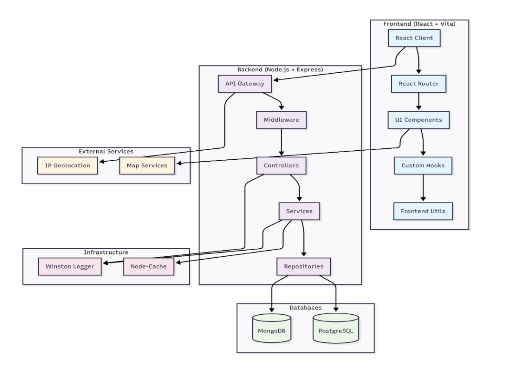

# Homelumina - Location-Based Real Estate & Community Analysis Platform

[](https://nodejs.org/)
[](https://reactjs.org/)
[](https://www.postgresql.org/)
[](https://www.mongodb.com/)
[](LICENSE)

## 📋 Table of Contents

- [Overview](#-overview)
- [App Demo](#-app-demo)
- [Authors](#-authors)
- [Features](#-features)
- [Tech Stack](#️-tech-stack)
- [Architecture](#️-architecture)
- [API Documentation](#-api-documentation)
- [License](#-license)
- [Acknowledgments](#-acknowledgments)

## 🏠 Overview

Homelumina is a full-stack real estate and community analysis platform processing 2.9M+ records, providing sub-second analytics queries, interactive maps, and personalized location recommendations

- 🏘️ Analyzes **2.9M+ housing records** across the U.S.
- ⚡ Optimized complex queries from **minutes → sub-second**
- 🗺️ Interactive maps, comparisons, and analytics
- 🧠 Designed with real-world data engineering constraints

## 🚀 Why This Project Is Non-Trivial

- Aggregating **millions of records** across heterogeneous datasets
- Designing performant analytics queries at ZIP + city level
- Optimizing PostgreSQL with indexes, materialized views, and query refactors
- Building a clean Controller-Service-Repository backend
- Visualizing dense data without overwhelming users

### Key Capabilities

- **Location-Based Recommendations**: Personalized city suggestions based on user's IP geolocation
- **Comprehensive Data Analysis**: Real estate prices, health metrics, facilities, and demographics
- **Interactive Comparisons**: Side-by-side city and ZIP code comparisons
- **Advanced Filtering**: Multi-criteria search with real-time filtering
- **Visual Analytics**: Interactive maps, charts, and data visualizations

## 🎬 App Demo

_These GIFs showcase the full application functionality and user experience._

### Full Demo Overview


### Homepage Demo


### Search & Filter Demo



### Map Interaction Demo


### Location Details Demo


### City Comparison Demo



## 👥 Authors

- **John Suli** Penn email: xsuli@seas.upenn.edu – [GitHub](https://github.com/FizzWinPie)
- **Dan Fitz** Penn email: danfitz@seas.upenn.edu – [GitHub](https://github.com/danfitz)
- **Filmon Mengisteab** Penn email: demekesh@seas.upenn.edu – [GitHub](https://github.com/FilmonFeMe)
- **Roy Hung** - Penn email: royshung@seas.upenn.edu – [GitHub](https://github.com/royshunhung)

## 🧑‍💻 My Contributions

- Designed PostgreSQL schema and performance optimizations
- Implemented analytics queries and similarity matching
- Built REST APIs and caching strategy
- Assisted in backend architecture building
- Preprocessed and cleaned data using pandas

## 🏆 AWARD - Best Overall Project

<figure>
  
  <figcaption>Winner of Best Overall Project Award from 13 teams in UPenn's CIS 550 - Databases and Information Systems</figcaption>
</figure>

**📖 [Full Technical Report (Project.pdf)](Project.pdf)** - Complete database design, query optimization strategies, performance benchmarks, and architectural decisions. Perfect for **technical reviewers** evaluating engineering depth

## ✨ Features

<details>
<summary><strong>🎯 Core Features</strong></summary>

- **Featured Cities**: Location-based and default city recommendations
- **Search & Filter**: Advanced ZIP code search with multiple criteria
- **Location Details**: Comprehensive location information and analytics
- **City Comparison**: Side-by-side city analysis and comparison
- **Interactive Maps**: Leaflet-based mapping with location markers
- **Data Visualization**: Charts and graphs for metrics analysis

</details>

<details>
<summary><strong>🔍 Search Capabilities</strong></summary>

- **Real Estate**: Price ranges, median home prices, affordability scores
- **Health Metrics**: Obesity, asthma, depression rates, healthcare access
- **Facilities**: Hospitals, police stations, fire departments, childcare centers
- **Demographics**: Population, income levels, growth rates
- **Quality of Life**: Safety scores, facility density, community ratings

</details>

<details>
<summary><strong>📊 Analytics Features</strong></summary>

- **Affordability Scoring**: Automated affordability calculations
- **Health Scoring**: Community health assessments
- **Facility Density**: Services per capita analysis
- **Growth Trends**: Historical and projected growth data
- **Similarity Matching**: Find similar locations based on criteria

</details>

### Dataset scale:

- 🏘️ 2.9M+ housing market records
- 🏥 8k+ hospitals
- 🚓 23k+ police departments
- 🧒 132k childcare centers

### Query Performance (After Optimization)

| Endpoint        | Worst Case (Before) | Worst Case (After) |
| --------------- | ------------------- | ------------------ |
| ZIP Code Search | ~2 minutes          | ~1.6s              |
| City Aggregate  | ~4s                 | ~400ms             |
| Similar Cities  | ~16s                | ~500ms             |
| Similar ZIPs    | ~8s                 | ~600ms             |

_Note: These are 4 worst performing queries from a total of 11 implemented_

**Key Optimizations**

- Indexes on ZIP code across all tables
- Materialized views for expensive aggregations
- Query refactoring with CTE reduction

📘 **Detailed schema, SQL, and benchmarks:**  
➡️ [`docs/DATABASE.md`](docs/DATABASE.md)  
➡️ [`docs/PERFORMANCE.md`](docs/PERFORMANCE.md)

## 🛠️ Tech Stack

<details>
<summary><strong>Frontend</strong></summary>

- **React 19.1.0**: Modern React with hooks and functional components
- **Vite**: Fast build tool and development server
- **TypeScript**: Type-safe JavaScript development
- **Tailwind CSS**: Utility-first CSS framework
- **Shadcn/UI**: High-quality React components
- **React Query**: Server state management
- **React Router**: Client-side routing
- **Leaflet**: Interactive mapping
- **Framer Motion**: Animation library
- **Lucide React**: Icon library

</details>

<details>
<summary><strong>Backend</strong></summary>

- **Node.js 18+**: JavaScript runtime
- **Express.js**: Web application framework
- **PostgreSQL**: Primary relational database
- **MongoDB**: NoSQL database for user data
- **Winston**: Logging framework
- **Node-Cache**: In-memory caching
- **Jest**: Testing framework
- **Swagger**: API documentation

</details>

<details>
<summary><strong>Infrastructure</strong></summary>

- **IP Geolocation**: Location-based features
- **Caching**: Multi-level caching strategy
- **Error Handling**: Comprehensive error management
- **Validation**: Input validation and sanitization

</details>

## 🏗️ Architecture

### High-Level Architecture

```
┌─────────────────┐    ┌─────────────────┐    ┌─────────────────┐
│   Frontend      │    │   Backend       │    │   Databases     │
│   (React/Vite)  │◄──►│   (Node.js)     │◄──►│   (PostgreSQL   │
│                 │    │                 │    │   + MongoDB)    │
└─────────────────┘    └─────────────────┘    └─────────────────┘
```

### Component Architecture

#### Frontend (React + Vite)

- **Pages**: Home, Search Results, Location Details, Comparison
- **Components**: Reusable UI components with Shadcn/UI
- **State Management**: React Query for server state, Context for global state
- **Styling**: Tailwind CSS with custom design system

<figure>
  
  <figcaption>Frontend architecture: React components, state management, and UI structure</figcaption>
</figure>

#### Backend (Node.js + Express)

- **Controllers**: HTTP request handlers and response formatting
- **Services**: Business logic and data processing
- **Repositories**: Data access layer with database abstraction
- **Middleware**: Validation, authentication, error handling

<figure>
  
  <figcaption>Backend architecture: Controller-Service-Repository pattern and API structure</figcaption>
</figure>

#### Databases

- **PostgreSQL**: Primary application data (ZIP codes, real estate, health, facilities)
- **MongoDB**: User management and session data

<figure>
  
  <figcaption>Overall system architecture: Frontend, backend, and database integration</figcaption>
</figure>

## 📚 API Documentation (The sections below are intended for developers exploring system internals)

### Core Endpoints

#### Search Endpoints

```bash
# Featured cities
GET /api/v1/search/featured-cities?limit=3

# Location-based featured cities
GET /api/v1/search/featured-cities/location-based?limit=3

# ZIP code summaries
GET /api/v1/search/zipcode-summaries?state=PA&city=Philadelphia&limit=50

# Autocomplete suggestions
GET /api/v1/search/autocomplete?term=191&limit=10
```

#### Analytics Endpoints

```bash
# City comparison
GET /api/v1/analytics/city-aggregate-comparison?city=Philadelphia&state=PA

# Similar cities
GET /api/v1/analytics/similar-cities/Philadelphia/PA?limit=10

# Growth rates
GET /api/v1/analytics/city-growth-rate/Philadelphia/PA
```

#### Health Endpoints

```bash
# Health measures by ZIP code
GET /api/v1/health/measures-by-zipcode/19104

# Community health properties
GET /api/v1/health/community/19104
```

#### Real Estate Endpoints

```bash
# Real estate stats by ZIP code
GET /api/v1/real-estate/stats-by-zipcode/19104

# Affordable housing options
GET /api/v1/real-estate/affordable-housing?maxPrice=500000&limit=10
```

### Response Format

```json
{
  "success": true,
  "data": [...],
  "message": "Success message",
  "metadata": {
    "totalCount": 10,
    "limit": 5
  }
}
```

## 📄 License

This project is licensed under the MIT License - see the [LICENSE](LICENSE) file for details.

## 🙏 Acknowledgments

### Data Sources

#### [Real Estate Data](http://Realtor.com)

- **Realtor.com Historical Data**: Comprehensive US housing market data per ZIP code (2016-2025)
  - 2.9 million entries covering median listing prices, active listings, and new listing counts
  - Provides historical trends and market comparisons against national averages

#### Health & Demographics

- **CDC Places, Local Data for Better Health (ZCTA Data 2024)**: 40 health measures across 32,520 US ZTCAs
  - 1.2 million entries covering obesity, asthma, depression rates, and healthcare access
  - Population-based health metrics for informed community health assessments

#### Public Safety & Infrastructure

- **US Fire Administration**: Fire department and personnel data per ZIP code

  - 26k entries covering fire departments, stations, and active firefighters
  - Critical for emergency response and safety assessments

- **Homeland Infrastructure Foundation-Level Database**: Comprehensive public safety data
  - **Police Data**: 23k entries with police departments and officer counts
  - **Hospital Data**: 8.3k entries with hospital counts per ZIP code
  - **Childcare Data**: 132k entries with childcare center locations

#### Geographic & Economic Data

- **United States ZipCode.org**: Geographic reference data

  - 42,736 entries with city, state, county, and coordinate information
  - Essential for location-based features and mapping

- **US Census Data AVG Income**: ZIP code level household income data
  - 31,919 entries with detailed income demographics
  - Critical for affordability calculations and economic analysis

### Platform Inspiration

Our application draws inspiration from leading location analysis platforms:

- **Niche**: Community and school ratings
- **AreaVibes**: Quality of life metrics
- **SpotCrime**: Crime data and safety information
- **City-Data**: Comprehensive city statistics

### Open Source Libraries

- **React, Node.js, PostgreSQL, MongoDB**: Core technology stack
- **Shadcn/UI and Tailwind CSS**: Modern UI components and styling
- **Leaflet and OpenStreetMap**: Interactive mapping capabilities
- **Framer Motion**: Smooth animations and transitions

**Homelumina** - Making informed decisions about where to live, one location at a time.
