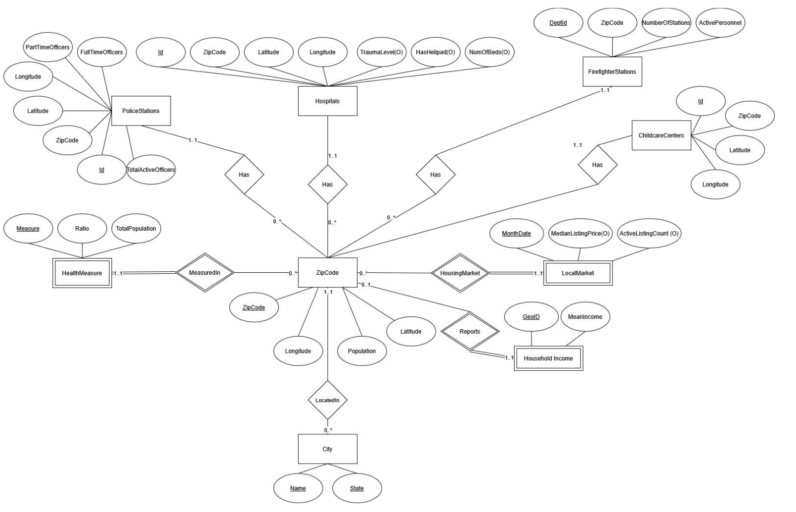
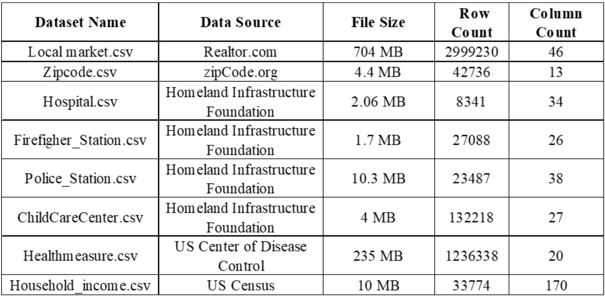

# Database Schema & Normalization

## Overview

The PostgreSQL database contains **9 relations**, all normalized to **BCNF** (Boyce-Codd Normal Form). ZIP code serves as the primary join key across all datasets, enabling efficient geographic data aggregation and analysis.

<figure>
  
  <figcaption>Figure 1. Entity Relationship Diagram showing all 9 relations and their relationships</figcaption>
</figure>

## Relational Schemas

### Core Geographic Tables

- **ZipCode**(ZipCode PK, Latitude, Longitude, Population, City, State)

  - Central reference table containing geographic and demographic data
  - Primary key: `ZipCode`
  - Links all other tables through foreign key relationships

- **City**(Name, State) PK, FK → ZipCode(City, State)
  - Composite primary key: `(Name, State)`
  - Foreign key references: `ZipCode(City, State)`
  - Provides city-level aggregations and summaries

### Facility Tables

- **ChildcareCenters**(Id PK, ZipCode FK, Latitude, Longitude)

  - Childcare facility locations and information
  - Foreign key: `ZipCode` → `ZipCode.ZipCode`

- **FirefighterStations**(DptId PK, ZipCode FK, NumOfStations, ActivePersonnel)

  - Fire department locations and staffing data
  - Foreign key: `ZipCode` → `ZipCode.ZipCode`
  - Includes station count and personnel information

- **PoliceStations**(DptId PK, ZipCode FK, PartTimeOfficers, FullTimeOfficers)

  - Police department locations and staffing data
  - Foreign key: `ZipCode` → `ZipCode.ZipCode`
  - Tracks both part-time and full-time officer counts

- **Hospitals**(Id PK, ZipCode FK, Latitude, Longitude, NumOfBeds, TraumaLevel, HasHelipad)
  - Hospital facility information with medical capabilities
  - Foreign key: `ZipCode` → `ZipCode.ZipCode`
  - Includes bed capacity, trauma level, and helipad availability

### Analytics Tables

- **HealthMeasure**(Measure, ZipCode PK/FK, Ratio, TotalPopulation)

  - Composite primary key: `(Measure, ZipCode)`
  - Foreign key: `ZipCode` → `ZipCode.ZipCode`
  - Health outcome metrics (obesity, asthma, depression, routine checkups, etc.)
  - Ratios normalized to 0-1 scale

- **HouseholdIncome**(GeoId PK, ZipCode FK, MeanIncome)

  - Primary key: `GeoId`
  - Foreign key: `ZipCode` → `ZipCode.ZipCode`
  - Mean household income by ZIP code for socioeconomic analysis

- **LocalMarket**(MonthDate, ZipCode PK/FK, MedianListingPrice)
  - Composite primary key: `(MonthDate, ZipCode)`
  - Foreign key: `ZipCode` → `ZipCode.ZipCode`
  - Real estate market data with monthly median listing prices
  - Date format: YYYYMM (e.g., 202501 for January 2025)
  - Contains **2.9M+ rows** of historical market data

## Normal Form Justification (BCNF)

All relations are normalized to **Boyce-Codd Normal Form (BCNF)**. This ensures:

- **No redundancy**: Each fact is stored exactly once
- **Data integrity**: All functional dependencies are implied by candidate keys
- **Efficient updates**: No update anomalies
- **Optimal storage**: Minimal data duplication

All functional dependencies are implied by candidate keys, eliminating partial and transitive dependencies.

## Database Relationships

### Foreign Key Relationships

All facility and analytics tables reference the `ZipCode` table through foreign key constraints:

- `ChildcareCenters.ZipCode` → `ZipCode.ZipCode`
- `FirefighterStations.ZipCode` → `ZipCode.ZipCode`
- `PoliceStations.ZipCode` → `ZipCode.ZipCode`
- `Hospitals.ZipCode` → `ZipCode.ZipCode`
- `HealthMeasure.ZipCode` → `ZipCode.ZipCode`
- `HouseholdIncome.ZipCode` → `ZipCode.ZipCode`
- `LocalMarket.ZipCode` → `ZipCode.ZipCode`
- `City(City, State)` → `ZipCode(City, State)`

### Join Strategy

ZIP code serves as the universal join key, enabling:

- Efficient geographic aggregations
- Cross-table analytics queries
- Location-based search and filtering
- Similarity calculations between locations

## Indexes

To optimize query performance, indexes have been created on:

- **ZipCode column** on all tables where it's not part of the primary key
- **Composite indexes** on frequently joined columns:
  - `(zipcode, medianlistingprice)` on `localmarket`
  - `(zipcode, ratio)` on `healthmeasure`
  - `(city, state)` on `zipcode` and `city` tables
- **Filtered indexes** for common query patterns:
  - `zipcode(population) WHERE population >= 10000`

See [PERFORMANCE.md](./PERFORMANCE.md) for detailed optimization strategies.

## Materialized Views

### market2025_view

- **Purpose**: Pre-aggregated housing market data for 2025
- **Optimization**: Reduces query time from 2+ minutes to ~1 second
- **Indexed on**: `zipcode`
- **Use case**: Fast retrieval of current median listing prices

### City and ZIP Aggregates

- **Purpose**: Precomputed aggregations for similarity calculations
- **Optimization**: Similar Cities queries: 15s → 0.5s, Similar ZIPs: 8s → 0.6s
- **Indexed on**: `(city, state)` and `zipcode`
- **Use case**: Location similarity and recommendation features

## Dataset Statistics

<figure>
  
  <figcaption>Figure 2. 3+ million data rows across 9 datasets were processed and normalized</figcaption>
</figure>

### Data Volume

- **Total rows**: 3+ million across all tables
- **Largest table**: `localmarket` with 2.9M+ rows
- **Geographic coverage**: United States ZIP codes
- **Time period**: Historical and current data (2025 focus)

### Data Quality

- Health measures include normalized ratios (0-1 scale)
- Real estate data uses consistent YYYYMM date format
- Population data provides context for health and demographic analyses
- Income data enables socioeconomic analysis and filtering
