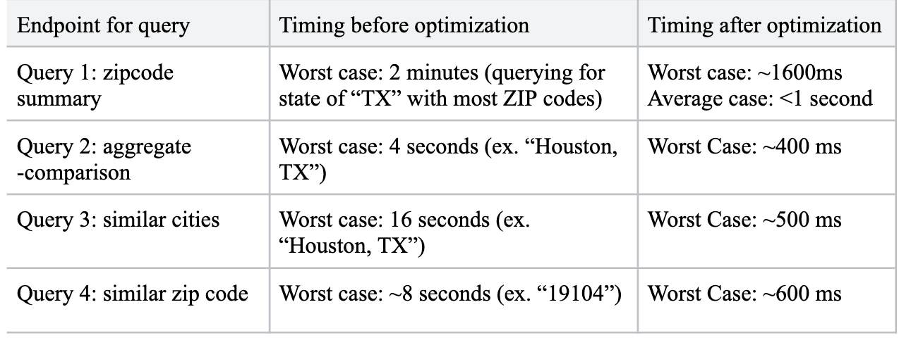

# Query Performance & Optimization

<figure>
  
  <figcaption>Figure 1. Worst performing queries</figcaption>
</figure>

## Indexing Strategy

Indexes were added on `ZipCode` for all tables where it was not part of the primary key.
This significantly reduced join cost across analytics queries.

## Materialized Views

### Housing Market Optimization

- `localmarket` contains **2.9M+ rows**
- Aggregating median prices dynamically was too slow

**Solution**

- Created `market2025_view` materialized view
- Indexed by ZIP code
- Reduced query time from **2+ minutes → ~1 second**

### Similarity Queries

Similarity calculations required:

- Full aggregation of all US ZIP codes / cities
- Cross joins for distance scoring

**Solution**

- Precomputed city and ZIP aggregates in materialized views
- Indexed on `(city, state)` and `zipcode`
- Reduced runtime:
  - Similar Cities: **15s → 0.5s**
  - Similar ZIPs: **8s → 0.6s**
